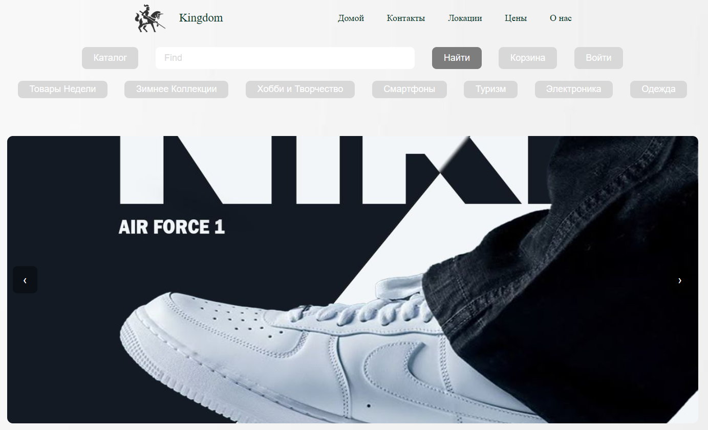

<h1 align="center">🛒 Landing Shop — Modern React Store</h1>

  

  Стильный, минималистичный и удобный лендинг-магазин, созданный на основе React + Vite.  
  Проект разработан с акцентом на чистый UI, удобство пользователя и плавные анимации.

---

## ✨ Основные возможности

✔️ Слайдер из 10 изображений  
✔️ Плавные переключения (left/right)  
✔️ Кнопка корзины (Font Awesome)  
✔️ Hover-анимации карточек товаров  
✔️ Единый минималистичный дизайн  
✔️ Лёгкая адаптация под мобильные устройства  
✔️ Лёгкая и быстрая сборка (Vite)

---

## 🎨 UI / UX особенности

- 🎚 Карточки товаров получают тень и лёгкое увеличение при наведении  
- 🖼 Слайдер работает плавно, без рывков  
- 🌫 Кнопки навигации затемнены и аккуратно вписываются в фон  
- ⚪ Фоновый цвет `#DCDCDC` делает сайт современным и воздушным  
- 🎛 Минимализм в каждом элементе

---

## 🧩 Технологии

| Технология | Использование |
|-----------|---------------|
| **React.js** | Основной UI |
| **Vite** | Молниеносная сборка |
| **CSS** | Индивидуальные стили |
| **Font Awesome** | Иконка корзины |
| **JavaScript ES6+** | Логика слайдера |
| **Google Fonts / Local fonts** | Стильный текст |

---

## 📁 Структура проекта

## 📂 Структура проекта

👤 Автор

Bekzod Iminjanov
Frontend Developer (React)
Student @ University of Business and Science
IT Enthusiast | Future FullStack Engineer